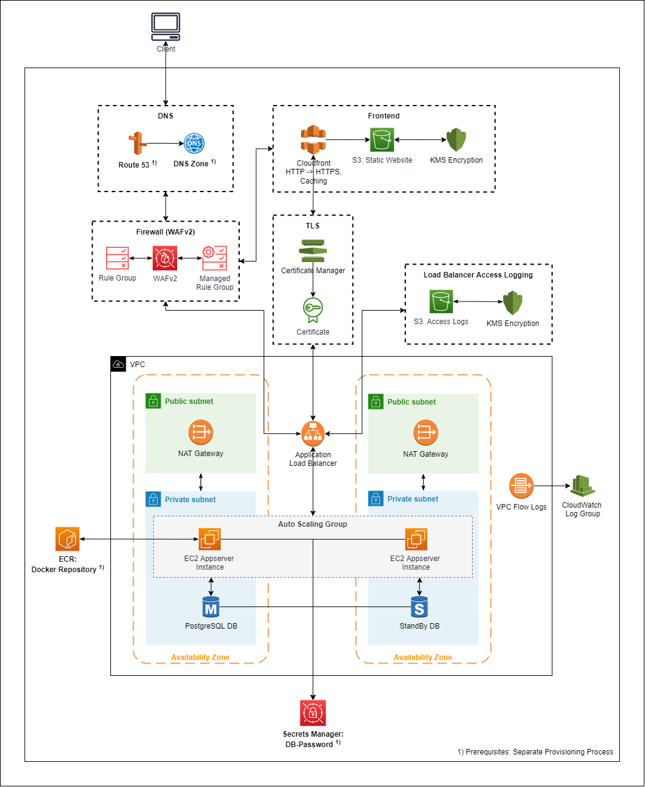

# Classic Three Tier Architecture in AWS <!-- omit in toc -->

1. [Summary](#summary)
2. [Architecture Diagram](#architecture-diagram)
3. [Getting Started](#getting-started)
   1. [Provsion Pre-requisites in AWS](#provsion-pre-requisites-in-aws)
      1. [Provision Terraform backend and state locking](#provision-terraform-backend-and-state-locking)
      2. [Setup DNS pre-requisites](#setup-dns-pre-requisites)
      3. [Setup Secrets Manager](#setup-secrets-manager)
      4. [Setup ECR Repository for you backend application](#setup-ecr-repository-for-you-backend-application)
   2. [Configure terraform variables](#configure-terraform-variables)
   3. [Provision infrastructure](#provision-infrastructure)
   4. [Add frontend website](#add-frontend-website)
   5. [Testing](#testing)
   6. [Ideas for Next Steps](#ideas-for-next-steps)
4. [Developer Instructions](#developer-instructions)
   1. [Install pre-commit tools](#install-pre-commit-tools)
   2. [Connect to App-Servers](#connect-to-app-servers)
5. [Terraform Documentation (generated by tf-docs)](#terraform-documentation-generated-by-tf-docs)
   1. [Requirements](#requirements)
   2. [Providers](#providers)
   3. [Modules](#modules)
   4. [Resources](#resources)
   5. [Inputs](#inputs)

# Summary
This terraform project has been created to provide a classical three tier architecture (frontend + backend + DB) in AWS using S3 + Cloudfront for the frontend and EC2 for the backend. Postgres has been chosen as the RDS engine for the database. This project is an experimental prototype - do not use in production.
The following goals have been cosidered:
- High availability
- Security
- Enforcing best practices for working with terraform
- Providing a classic architecture for migration purposes

**Features:**
- **High availability**: Using replication of all services across two different AZs. 
- **Multi-level security**: IAM roles, security groups, network ACLs and WAFv2 have been setup to provide security for the VPC. WAFv2 uses managed rule sets based on the OWASP Top 10 and protects the frontend as well as the backend. Data stored in S3, RDS and EC2 is encrypted. HTTPS is being used for frontend and backend communication. Further security mechanisms like CloudFront security header configs have been provided.
- **IP address whitelisting**: For testing purposes you can limit the IP addresses that should be able to access your application. This restriction is enforced on WAFv2 levels.
- **Access to EC2 instances using Session Manager**: No need to open SSH ports, you can access the instances using AWS Session Manager (see Developer Instructions)
- **Terraform remote state with locking**: The terraform state is stored remotely in an S3 bucket and locking is done via DynamoDB. The S3 bucket and DynamoDB table need to be provisioned separately and the connection details added to the backend configuration block in the root module.
- **Logging**: Load balancer access logs and VPC flow logs have been set up to enable operators to get insights about incoming and outgoing traffic. S3 bucket access logs and Cloudfront logs are also provided. Postgres DB logs will be exported with enhanced monitoring metrics.

# Architecture Diagram

# Getting Started
In order to get started with this new architecture, you can use the [Simple Java REST Backend](https://github.com/MWSandbox/simple-java-rest-backend) in combination with the [Simple React Frontend](https://github.com/MWSandbox/simple-react-frontend) to deploy a sample application.

## Provsion Pre-requisites in AWS
The following services need to be provisioned prior to running the terraform scripts as pre-requisites, since they are required to run terraform in your account or are re-using domain names / application specific artifactories that are not the focus of this terraform project.

| Service                       | Description                                                                                                 |
| ----------------------------- | ----------------------------------------------------------------------------------------------------------- |
| S3 Bucket                     | Will act as terraform backend to store the state remotely. Needs to be created manually as a pre-requisite. |
| DynamoDB Table                | Will be used for terraform state locking.                                                                   |
| Route 53 Domain + Hosted Zone | Your custom domain name to be used to access the application.                                               |
| ECR Repository                | Docker repository containing your application backend.                                                      |
| Secrets Manager                | Securely stores the DB password and therefore needs to be setup manually once.                             |

### Provision Terraform backend and state locking
- Create a new S3 bucket in your AWS region, which will store the terraform state remotely:
  - Use server side encryption, since the terraform state may contain sensitive data
  - Enable bucket versioning
  - Make the bucket private
- Create a new DynamoDB table, which will be used for state locking:
  - As partition key use "LockID" of type String
- Make sure that the user who will be running terraform has access to both resources
- For more information have a look at the [official terraform documentation](https://www.terraform.io/docs/language/settings/backends/s3.html)

### Setup DNS pre-requisites
- If you already have your own domain, you can re-use that. Make sure that it is available in Route 53. If you do not have a domain yet, you could request a new one via Route 53. For more information have a look at the [AWS documentation](https://docs.aws.amazon.com/Route53/latest/DeveloperGuide/domain-register-update.html)
- Once you have created your domain, create a hosted zone for it
- Further DNS records will be created by this terraform project automatically for you

### Setup Secrets Manager
- Secrets Manager will be used to store the database credentials in a secure way.
- Create a new secret in AWS Secrets Manager with a single secret value
- You can choose any key and any password you like, this terraform project will read the secret and use the provided password when setting up the database

### Setup ECR Repository for you backend application  
- The ECR repository will contain your application to be deployed onto the EC2 instances. 
- This terraform project works great with the [Simple Java Rest Backend](https://github.com/MWSandbox/simple-java-rest-backend). It provides a user data file for your EC2 instances to automatically pull the image from the ECR repository and run it once an instance is being created. If you want to use the `Simple Java Rest Backend`:
  - Create the ECR repository
  - Add the repository to your pom.xml
  - Run `mvn deploy` to build the docker image and push it to the ECR repository

## Configure terraform variables
After provisioning the pre-requisites you can open the `.auto.tfvars` file and update the variables accordingly. Please also check the default values in `variables.tf`. If you want to use different values, you can override them with the `.auto.tfvars` file. Hint: If you need multiple stages, create a tfvars file for each stage with the corresponding configuration. You can choose the input variables to be used by running `terraform apply -var-file="your-file.tfvars"`

## Provision infrastructure
Run `terraform plan` to see all the changes that will be rolled out to your AWS account. Run `terraform apply` to rollout the changes.

## Add frontend website
After the infrastructure has been provisioned, you can deploy the frontend website to the frontend S3 bucket. If you are using the `Simple React Frontend`:
  - Open `.env.production` and add your backend URL
  - Run `npm run build`
  - Upload everything from the `build` directory to the S3 frontend bucket

## Testing
- Open the frontend URL to access the website and check if the connection to the backend is working
- Open the backend URL to check if the backend is reachable
- Have a look at the S3 logging bucket and cloud watch for the access logs and VPC flow logs

## Ideas for Next Steps
- Build a CI/CD pipeline to make the application builds and deployments easier and automated (not part of this project)
- Add further monitoring / logging tools
- Automatically transfer log files to storage classes for infrequently accessed data after an amount of time
- Add alerts when autoscaling groups are scaling in/out

# Developer Instructions
If you want to reuse this project and customize it to your needs, this guide will help you with the setup.

## Install pre-commit tools
- This project is using configurations for [pre-commit-terraform]: https://github.com/antonbabenko/pre-commit-terraform which is a collection of pre-commit hooks for terraform projects.
- The following hooks are being used:
  - terraform_fmt: Makes sure the project is properly formatted before adding new commits
  - checkov: Static Code Analysis
  - terraform_tfsec: Static Code Analysis with focus security
  - terrascan: Static Code Analysis
  - terraform_docs: Generates parts of the README files for each module
  - infracost_breakdown: Makes sure that the operating costs of the infrastructure are not exceeding given thresholds
- If you want to use infracost: Install infracost natively and generate an API key - see [Infracost documentation](https://www.infracost.io/docs/)
- To setup the hooks on your machine proceed as follows:
  - Checkout the git repository from https://github.com/antonbabenko/pre-commit-terraform
  - In the git repository directory run `docker build -t pre-commit --build-arg INSTALL_ALL=true .` to build the docker image
  - In the classic-architecture project repository run the script located at `build-tools/setup-pre-commit-tf-docker-hook.sh` to install the pre commit hook for git
  - After each commit you should get an overview of the findings of each tool. terraform_fmt and terraform_docs will fail if the formatting is not correct or the docs are not complete. But the hooks will fix these problems automatically. In this case you can simply stage the changes in git and run the commit command once again.
- You will find some comments in the terraform files ignoring some checks from the pre-commit tools. For each skipped rule, a reason has been given.

## Connect to App-Servers
- Due to security reasons direct SSH access to the EC2 instances is not enabled
- However you can connect to the instances using AWS Session Manager. Each instance created will use an IAM role with the required permissions to be accesses by AWS Session Manager
- In order to connect: Open AWS Systems Manager -> Click on "Session Manager" on the left pane -> Select the instance you want to connect to
- For sudo permissions run `sudo -s`
- Access log files of the Apache server are located in `/etc/httpd/logs`
- If you want to choose a different AMI you might need to install the amazon-ssm-agent in your user data script when launching the instance

# Terraform Documentation (generated by tf-docs)

<!-- BEGIN_TF_DOCS -->
## Requirements

| Name | Version |
|------|---------|
|  [terraform](#requirement\_terraform) | >= 1.2.0 |
|  [aws](#requirement\_aws) | ~> 4.21 |
|  [http](#requirement\_http) | ~> 2.2 |
|  [template](#requirement\_template) | ~> 2.2 |

## Providers

| Name | Version |
|------|---------|
|  [http](#provider\_http) | 2.2.0 |

## Modules

| Name | Source | Version |
|------|--------|---------|
|  [app](#module\_app) | ./modules/app | n/a |
|  [backend\_dns\_setup](#module\_backend\_dns\_setup) | ./modules/dns | n/a |
|  [backend\_tls\_certificate](#module\_backend\_tls\_certificate) | ./modules/tls_certificate | n/a |
|  [cloudfront\_firewall](#module\_cloudfront\_firewall) | ./modules/firewall | n/a |
|  [db](#module\_db) | ./modules/db | n/a |
|  [frontend](#module\_frontend) | ./modules/frontend | n/a |
|  [frontend\_dns\_setup](#module\_frontend\_dns\_setup) | ./modules/dns | n/a |
|  [frontend\_tls\_certificate](#module\_frontend\_tls\_certificate) | ./modules/tls_certificate | n/a |
|  [load\_balancer](#module\_load\_balancer) | ./modules/load_balancer | n/a |
|  [load\_balancer\_firewall](#module\_load\_balancer\_firewall) | ./modules/firewall | n/a |
|  [logging](#module\_logging) | ./modules/logging | n/a |
|  [vpc\_network](#module\_vpc\_network) | ./modules/vpc-network | n/a |

## Resources

| Name | Type |
|------|------|
| [http_http.my_public_ip](https://registry.terraform.io/providers/hashicorp/http/latest/docs/data-sources/http) | data source |

## Inputs

| Name | Description | Type | Default |
|------|-------------|------|---------|
|  [app\_server\_ami](#input\_app\_server\_ami) | AMI to use for provisioning the EC2 instances of the app servers. | `string` | `"ami-058e6df85cfc7760b"` |
|  [app\_server\_instance\_type](#input\_app\_server\_instance\_type) | Instance type of the EC2 instances running the app servers. | `string` | `"t2.micro"` |
|  [app\_server\_scaling](#input\_app\_server\_scaling) | Properties used to autoscale the appservers. | <pre>object({     desired_capacity = number     min_capacity     = number     max_capacity     = number     cpu_threshold    = number   })</pre> | <pre>{   "cpu_threshold": 60,   "desired_capacity": 2,   "max_capacity": 4,   "min_capacity": 2 }</pre> |
|  [app\_server\_volume\_size](#input\_app\_server\_volume\_size) | EBS volume size for the app servers EC2 instances. | `number` | `8` |
|  [app\_version\_to\_deploy](#input\_app\_version\_to\_deploy) | Default version to be deployed, when a new EC2 instance starts (e.g. latest) from the PROD ECR registry. | `string` | n/a |
|  [availability\_zones](#input\_availability\_zones) | List of availability zones to run the infrastructure. Number of availability zones should match number of private/public subnets for high availability. | `list(string)` | n/a |
|  [backend\_dns\_prefix](#input\_backend\_dns\_prefix) | The prefix to the domain name to be used to access the backend. Backend DNS name = backend\_dns\_prefix + domain\_name. Has to end with a dot. | `string` | n/a |
|  [common](#input\_common) | Common properties reused in multiple modules. | <pre>object({     project_name = string     aws_region   = string   })</pre> | n/a |
|  [context\_path](#input\_context\_path) | Context path the application is deployed on the app server. | `string` | n/a |
|  [country\_keys\_for\_caching](#input\_country\_keys\_for\_caching) | List of country keys to use as caching locations by CloudFront. | `list(string)` | n/a |
|  [db\_backup\_retention\_period\_in\_days](#input\_db\_backup\_retention\_period\_in\_days) | Period in days in which backups of the DB should be kept. | `number` | `2` |
|  [db\_instance\_class](#input\_db\_instance\_class) | Instance class to use for the DB servers. | `string` | `"db.t3.small"` |
|  [db\_monitoring\_interval\_in\_seconds](#input\_db\_monitoring\_interval\_in\_seconds) | Period in seconds in which the enhanced monitoring metrics of the DB instance should be collected. | `number` | `60` |
|  [db\_name](#input\_db\_name) | Name of the database to be created. | `string` | n/a |
|  [db\_password\_secret\_key](#input\_db\_password\_secret\_key) | Key inside the secret in AWS Secrets Manager referencing the DB password. | `string` | n/a |
|  [db\_password\_secret\_name](#input\_db\_password\_secret\_name) | Name of the secret in AWS Secrets Manager holding the DB password. | `string` | n/a |
|  [db\_postgres\_version](#input\_db\_postgres\_version) | Postgres version to provision the DB instance. | `string` | `"11"` |
|  [db\_user](#input\_db\_user) | DB user to be created. | `string` | n/a |
|  [domain\_name](#input\_domain\_name) | Your domain name under which the application should be accessible. | `string` | n/a |
|  [ecr\_repository](#input\_ecr\_repository) | List of country keys to use as caching locations by CloudFront. | `string` | n/a |
|  [flow\_log\_format](#input\_flow\_log\_format) | Format of the VPC flow logs | `string` | `"${account-id} ${action} ${srcaddr} ${srcport} ${dstaddr} ${dstport} ${az-id} ${subnet-id} ${type} ${traffic-path} ${flow-direction} ${bytes}"` |
|  [frontend\_dns\_prefix](#input\_frontend\_dns\_prefix) | The prefix to the domain name to be used to access the frontend. Frontend DNS name = frontend\_dns\_prefix + domain\_name. Has to end with a dot. | `string` | n/a |
|  [is\_own\_ip\_restricted](#input\_is\_own\_ip\_restricted) | True, if the application should only be available from your own public IPv4 address. The address will be resolved automatically. | `bool` | n/a |
|  [is\_standby\_db\_required](#input\_is\_standby\_db\_required) | True, if a standby DB should be provisioned in a separate AZ. | `bool` | `true` |
|  [load\_balancer\_access\_logs\_prefix](#input\_load\_balancer\_access\_logs\_prefix) | Prefix of the load balancer access logs that will be stored inside the logging S3 bucket. | `string` | `"classic-arch-lb"` |
|  [private\_subnet\_cidrs](#input\_private\_subnet\_cidrs) | CIDRs of the private subnets. | `list(string)` | <pre>[   "10.0.2.0/23",   "10.0.4.0/23" ]</pre> |
|  [public\_subnet\_cidrs](#input\_public\_subnet\_cidrs) | CIDRs of the public subnets. | `list(string)` | <pre>[   "10.0.0.0/24",   "10.0.1.0/24" ]</pre> |
|  [static\_ip\_accept\_list](#input\_static\_ip\_accept\_list) | List of IPv4 addresses that should be able to call the application. All other IP addresses will be blocked by WAFv2 and S3 bucket policies. To permit access from everywhere, please add 0.0.0.0/0 to the list. | `list(string)` | n/a |
|  [vpc\_cidr](#input\_vpc\_cidr) | CIDR of the VPC running most of the infrastructure. | `string` | `"10.0.0.0/16"` |
<!-- END_TF_DOCS -->